# 🎯 OOPs-I-Did-It

Welcome to **OOPs-I-Did-It** – a fun and practical journey through the world of **Object-Oriented Programming (OOP)**. This repo contains simple, real-world examples to help you understand and master key OOP concepts.

---

## 📚 What You'll Learn

- ✅ Class & Object  
- ✅ Encapsulation  
- ✅ Inheritance  
- ✅ Polymorphism  
- ✅ Abstraction  
- ✅ Constructors  
- ✅ Method Overloading & Overriding  

---

## 🧠 Why OOP?

> “OOP is not just a concept — it's how you think about and design your code.”

Object-Oriented Programming helps make your code:
- Modular  
- Reusable  
- Maintainable  
- Scalable  

---

## 🧩 OOP Concept Flow Diagram

```mermaid
flowchart TD
    A[OOPs Concepts]

    A --> B[Class & Object Lifecycle]
    B --> C[Instance Block]
    B --> D[Static Block]
    B --> E[Constructor Overloading]
    B --> F[Private Constructor]

    A --> G[Inheritance]
    G --> H[Simple Inheritance]
    G --> I[MultiLevel Inheritance]
    G --> J[Hierarchical Inheritance]
    G --> K[Super Keyword]
    G --> L[This Keyword]
    L --> M[Calling Default Constructor]

    A --> N[Polymorphism]
    N --> O[Method Overriding]
    N --> P[Method Overloading]
    N --> Q[Covariant Return Type]
    N --> R[Override Annotation]
    N --> S[Var-args]

    A --> T[Abstraction]
    T --> U[Abstract Class]
    T --> V[Abstract Method]
    T --> W[Interface]
    W --> X[Interface JDK 1.8 - default & static]

    A --> Y[Encapsulation]

    A --> Z[SOLID Principles]

    A --> AA[Static Confusion]
    A --> AB[Instance Doesn’t Return]

    A --> AC[Exception Handling]
    AC --> AD[Intro to Exception Handling]
    AC --> AE[Exception Hierarchy]
    AC --> AF[try-catch-finally]
    AC --> AG[Checked Exception]
    AC --> AH[Unchecked Exception]
    AC --> AI[final / finally / finalize]
    AI --> AJ[finalize Method]
    AC --> AK[throw / throws]
    AC --> AL[Exception Propagation]

    classDef blue fill:#DDF,stroke:#333,stroke-width:1px;
    class A,G,T,AC blue;

```

---

## 🌐 Want to Connect?

- 💼 [LinkedIn](https://www.linkedin.com/in/vibhu-dixit-b42a11251/)
- 🌐 [Portfolio](https://vibhuportfolioo.netlify.app/)

---

## ✨ Contributions Welcome

Feel free to **fork this repo**, **open issues**, or **submit pull requests**.  
Let’s master OOP together — one concept at a time! 🚀

---

## 📌 License

This project is licensed under the **MIT License**.  
Use it freely, modify it, and spread the knowledge. 💡

---
